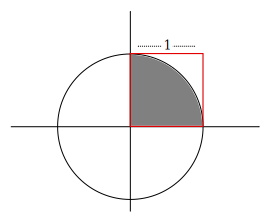

CoArray Fortran example
=======================

Here, we want to calculate $$\pi$$ with a Monte-Carlo algorithm. Each image will
compute its own Monte Carlo average, and the global average will be computed at
the end.



The area inside a unit circle is $$\pi$$. The red square is the square
containing all points with coordinates in the $$([0,1],[0,1])$$ range. The grey
area represents the set of points that are in the $$([0,1],[0,1])$$ range and
which are at a distance less than one to the center of the circle. For the
computation of $$\pi$$ with a Monte Carlo algorithm, each sample will consist
in drawing two uniform random numbers in the $$[0,1]$$ range (one for the $$x$$
coordinate and one for the $$y$$ coordinate). Is the distance of the point to
the center is less than one, we increment a counter. Our estimate of $$\pi$$
will be $$4 N_{\rm inside} / N_{\rm total}$$.

Single core program
-------------------

Let us first write a single core program. We write the providers in the
``pi.irp.f`` file. The ``N_steps`` entity defines the number of Monte-Carlo
steps to compute the value of $$\pi$$ in a single process.

``` irpf90
BEGIN_PROVIDER [ integer*8, N_steps ]
 implicit none
 BEGIN_DOC
 ! Total number of MC steps 
 END_DOC
 N_steps = 10000000_8
END_PROVIDER
```

The ``N_blocks`` entity is the total number of independent calculations of
$$\pi$$ one will do in a single process.

``` irpf90
BEGIN_PROVIDER [ integer, N_blocks ]
 implicit none
 BEGIN_DOC
 ! Total number of blocks, each containing N_steps steps.
 END_DOC
 N_blocks = 100
END_PROVIDER
```

One will need to initialize the seed of the Fortran random number generator:

``` irpf90
subroutine init_seed(i)
  implicit none
  integer, intent(in) :: i
  BEGIN_DOC
! Initializes the random seed with the current this_image()
  END_DOC
  integer :: seed(12)
  seed(:) = i
  call random_seed(put=seed)
end
```

``pi_block`` is the Monte-Carlo evaluation of $$\pi$$ over ``N_steps``.

```
BEGIN_PROVIDER [ double precision, pi_block ]
 implicit none
 BEGIN_DOC
 ! Value of pi computed over N_steps
 END_DOC

 integer                        :: i_step
 integer*8                      :: count_in
 double precision               :: x,y

 count_in = 0_8

 do i_step=1,N_steps
   call random_number(x)
   call random_number(y)
   if ( (x*x + y*y) <= 1.d0) then
     count_in += 1_8
   endif
 enddo
 pi_block = 4.d0*dble(count_in)/dble(N_steps)

END_PROVIDER
```


Let us now write the main program in ``test_mono.irp.f``. It will print the
running average and error bar of $$\pi$$ on the standard output:

``` irpf90
program test_mono
  implicit none
  BEGIN_DOC
! Test the single core program
  END_DOC
  integer          :: i
  double precision :: pi_sum, pi_sum2, n
  double precision :: pi_average, pi_variance, pi_error

  call init_seed(1)

  pi_sum  = 0.d0
  pi_sum2 = 0.d0
  n = 0.d0
  do i=1,N_blocks
    PROVIDE pi_block
    n += 1.d0
    pi_sum  += pi_block
    pi_sum2 += pi_block*pi_block
    pi_average = pi_sum / n
    pi_variance = pi_sum2/n - pi_average**2
    pi_error = sqrt(pi_variance/(n-1.d0))
    print *,  pi_average, '+/-', pi_error
    FREE pi_block
  enddo
end
```

The output of this program gives:

``` 
$ ./test_mono
   3.14213880000000      +/-                     NaN
   3.14194260000000      +/-  1.961999945451743E-004
   3.14176573333333      +/-  2.100316592883950E-004
   3.14156600000000      +/-  2.488976753433852E-004
   3.14144144000000      +/-  2.295326231094694E-004
...
   3.14160352500000      +/-  5.354283981217712E-005
   3.14160270103093      +/-  5.299438256043764E-005
   3.14159646938776      +/-  5.281972755126230E-005
   3.14160685252525      +/-  5.330451270701332E-005
   3.14161012000000      +/-  5.286984052818029E-005
```

Parallel program
-----------------

Now, we will write the prallel version of the program. First we will add to the
``Makefile`` the ``--coarray`` option to ``irpf90`` and the ``-coarray`` option
to ``ifort``.

We can now write the parallel main program:

``` irpf90
program test_caf
  implicit none
  BEGIN_DOC
! Test the single core program
  END_DOC

  integer          :: i,j
  double precision :: pi_sum, pi_sum2, n
  double precision :: pi_average, pi_variance, pi_error
  double precision, allocatable :: pi_block_local(:)

  allocate (pi_block_local(num_images()))

  call init_seed(11*this_image())

  pi_sum  = 0.d0
  pi_sum2 = 0.d0
  n = 0.d0
  do i=1,N_blocks
    PROVIDE pi_block
    do j=1,num_images()
      pi_block_local(j) = pi_block[j]
    enddo
    SYNC ALL
    if (this_image() == 1) then
      do j=1,num_images()
        n += 1.d0
        pi_sum  += pi_block_local(j)
        pi_sum2 += pi_block_local(j)*pi_block_local(j)
      enddo
      pi_average = pi_sum / n
      pi_variance = pi_sum2/n - pi_average**2
      pi_error = sqrt(pi_variance/(n-1.d0))
      print *,  pi_average, '+/-', pi_error
    endif
    FREE pi_block
  enddo

  deallocate(pi_block_local)
end
```

Using 4 processes, the output of the program gives:
```
$ ./test_caf
   3.14237790000000      +/-  4.966975835348314E-004
   3.14234140000000      +/-  2.348424884354168E-004
   3.14224363333333      +/-  1.958218077039208E-004
   3.14210150000000      +/-  1.786455096347535E-004
   3.14193388000000      +/-  1.646706423564424E-004
...
   3.14161792187500      +/-  2.869715284522186E-005
   3.14161840309278      +/-  2.842813192882745E-005
   3.14161785918367      +/-  2.815996517045344E-005
   3.14161942727273      +/-  2.794672232344559E-005
   3.14162559000000      +/-  2.785054179473510E-005
```

One can see that the error bar is twice smaller than in the single core program.
This reflects the fact that there are four times more samples.

