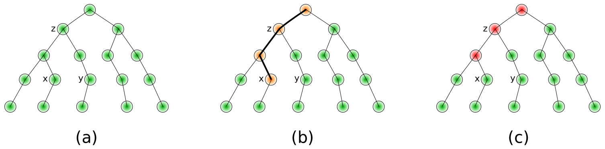

Modifying entities outside of providers
=======================================

Touch
-----

IRPF90 guarantees that an entity will not be re-provided if its value is
already computed and valid. If the value of an entity is modified by a side
effect outside of its provider, all the entities which are parent of the
modified entity should be invalidated. This is done using the ``TOUCH``
keyword.



In this example, all the entities have been provided (figure (a)). If the user
requests the value of `z`, it will be fetched from the memory. Then, the value
of `x` is modified by a side effect, so the tree is not valid any more. Using
``TOUCH x`` (figure (b)), all the parents are invalidated, but the value of `x`
is set as valid (figure (c)). Requesting `z` now will give the correct value of
`z` taking account of the modification of `x` and re-providing only what is
necessary between `x` and `z`.


Iterative processes
-------------------

An iterative process at iteration `n` is characterized by :
``A(n+1)`` needs ``C(n)`` needs ``B(n)`` needs ``A(n)`` needs ``C(n-1)`` etc...

As in IRPF90 the dependence tree is static, we will want to write
the iterative process as: ``A`` needs ``B`` needs ``C`` needs ``A``...
But this implies a cyclic dependency. In that case, we will violate the
rule that an entity is created only by one provider, and we will allow ``C`` to
be modified from outside of its provider, such that it only depends on ``C0``, its
initial guess value. The provider of ``C`` will then only describe its
initialization by copying its initial guess value ``C0``.

```irpf90
BEGIN_PROVIDER [ double precision, C ]
  C = C0
END_PROVIDER 
```

The converged value ``A_converged`` of ``A`` will be written as follows:

```irpf90
BEGIN_PROVIDER [ double precision, A_converged ]
  logical :: iteration_condition
  do while (iteration_condition)
    ! Modify the value of C depending on 
    ! the current value of A
    C = f(A)
    TOUCH C
  enddo
  A_converged = A
END_PROVIDER 
```

Soft touch
----------

When IRPF90 encounters the ``TOUCH`` keyword, it produces the following Fortran code:

```fortran
! >>> TOUCH x
 call touch_x
! <<< END TOUCH
  if (.not.a_is_built) then
    call provide_a
  endif
  if (.not.b_is_built) then
    call provide_b
  endif
```

After a ``TOUCH`` statement, all the entities in the current variable scope are
provided again to ensure that the program will be correct. This can sometimes
lead to providing entities that will not be needed later, especially in the
cases where the ``TOUCH`` statement is the last statement of a provider.

The ``SOFT_TOUCH`` statement has the same effect as ``TOUCH``, except that
the entities in the current scope are not re-provided. It can be used as an
optimization of the ``TOUCH`` when all the other entities are no more used in
the current subroutine, function or provider. However, it has to be used with
caution.


