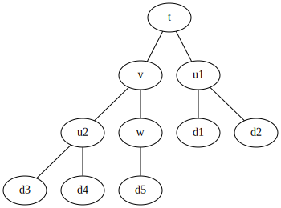

The Implicit Reference to Parameters programming strategy
=========================================================

The Implicit Reference to Parameters (IRP) method was first introduced by François
Colonna in the paper
[IRP programming : an efficient way to reduce inter-module coupling](http://osp.chickenkiller.com/mediawiki/index.php?title=IRP_programming_:_an_efficient_way_to_reduce_inter-module_coupling). Here, we only give a practical overview of the main
ideas, but the reader is encouraged to read the original paper.


A scientific program (or sub-program) is a complicated function of its data.
One can represent the program as a tree whose root is the output and whose
leaves are the data. The nodes are the intermediate variables, and the edges
represent the *needs/needed_by* relationships.

Let us consider a program which computes `t( u(d1,d2), v(u(d3,d4), w(d5)) )`
with

```
u(x)   = x + y + 1
v(x)   = x + y + 2
w(x)   = x + 3
t(x,y) = x + y + 4
```

This program can be represented with the following tree:



Writing the program in Fortran would require the programmer to have this tree
in mind:

```fortran
program compute_t
    implicit none

    integer :: d1, d2, d3, d4 d5  ! Input data
    integer :: u1, u2, v, w, t    ! Computed entities
    
    call read_data(d1,d2,d3,d4,d5)

    call compute_u(d1,d2,u1)
    call compute_u(d3,d4,u2)
    call compute_w(d5,w)
    call compute_v(u2,w,v)
    call compute_t(u1,v,t)
    
    write(*,*), "t=", t
    
end program
```

This way of programming is imperative, which is the natural way to write
Fortran : the programmer tells the machine how its internal state will change
by giving step-by-step instructions.
If the instructions are not given in the proper order, the program is wrong.
Therefore, at each line the programmer has to be aware of the full state of the
program, which results from the *needs/needed_by* relationships of the
variables. Imperative programming explores the tree from the leaves to the
root.


The same program can be written using the functional programming paradigm.
Instead of telling the machine *what to do*, we can express *what we want*.
Considering the program this way explores the tree from the root to the leaves.

```fortran
program compute_t
    implicit none

    integer :: d1, d2, d3, d4 d5        ! Input data
    integer, external :: u, u, v, w, t  ! Functions
    
    call read_data(d1,d2,d3,d4,d5)

    write(*,*), "t=", t( u(d1,d2), v( u(d3,d4), w(d5) ) )

end program
```

Now, the *needs/needed_by* relationships between the entities are expressed by
calling function `t`. The programmer doesn't handle any more the order in
which the instructions will be executed : we don't known which one `u(d3,d4)`
and `w(d5)` will be executed first. However, the global knowledge of the tree
is still required to write this program.

In order to get rid of the *global knowledge* of the tree, we will transform it
into *local knowledge*, which is much easier to handle.
For each entity, we will only express the other needed entities:

* t  -- needs --> u1 and v
* u1 -- needs --> d1 and d2
* v  -- needs --> u2 and w
* u2 -- needs --> d3 and d4
* w  -- needs --> d5

It appears now that the arguments of the functions are not *variables* but
*parameters*. In that case, we can put the parameters inside the functions,
as they will always be the same.

```fortran
program compute_t
    implicit none
    integer, external :: t
    write(*,*), "t=", t()
end program

integer function t()
    implicit none
    integer, external :: u1, v
    t = u1() + v() + 4
end

integer function w()
    implicit none
    integer :: d1,d2,d3,d4,d5
    call read_data(d1,d2,d3,d4,d5)
    w = d5+3
end

integer function v()
    implicit none
    integer, external :: u2, w
    v = u2() + w() + 2
end

integer function u1()
    implicit none
    integer :: d1,d2,d3,d4,d5
    integer, external :: f_u
    call read_data(d1,d2,d3,d4,d5)
    u1 = f_u(d1,d2)
end

integer function u2()
    implicit none
    integer :: d1,d2,d3,d4,d5
    integer, external :: f_u
    call read_data(d1,d2,d3,d4,d5)
    u2 = f_u(d3,d4)
end

integer function f_u(x,y)
    implicit none
    integer, intent(in)  :: x,y
    f_u = x+y+1
end

subroutine read_data(d1,d2,d3,d4,d5)
    implicit none
    integer, intent(out) :: d1,d2,d3,d4,d5
    print *,  'd1,d2,d3,d4,d5 ?'
    read (*,*) d1,d2,d3,d4,d5
end
```

Now, the program automatically builds the tree and explores it. The programmer
doesn't have to handle the execution of the code any more.
However, there are a few aspects that can be improved. First, we have to
write many empty parentheses ``()`` which make the code less readable.
Secondly, we have to declare the return type of these functions every time
we use them.  Finally there is a major drawback: here, the data
(``d1``...``d5``) is read three times because there is no way to know that it
has already been read.
These last points can all be easily addressed. Indeed, if a function is a
[pure function](http://en.wikipedia.org/wiki/Pure_function) (with no side
effects), calling the function with the same values as arguments will always
return the same value. In our program, the functions have no arguments, so we
only need to build once the return value and cache it for subsequent calls.
This mechanism is known as
[memoization](http://en.wikipedia.org/wiki/Memoization).


For each node we write a *builder*, which is a subroutine that builds
a *valid* value of an entity (according to the equations given at the beginning
of this section).

```fortran
subroutine build_t(x,y,result)
    implicit none
    integer, intent(in)  :: x, y
    integer, intent(out) :: result
    result = x + y + 4
end subroutine build_t

subroutine build_w(x,result)
    implicit none
    integer, intent(in)  :: x
    integer, intent(out) :: result
    result = x + 3
end subroutine build_w

subroutine build_v(x,y,result)
    implicit none
    integer, intent(in)  :: x, y
    integer, intent(out) :: result
    result = x + y + 2
end subroutine build_v

subroutine build_u(x,y,result)
    implicit none
    integer, intent(in)  :: x, y
    integer, intent(out) :: result
    result = x + y + 1
end subroutine build_u

subroutine build_d(d1,d2,d3,d4,d5)
    implicit none
    integer, intent(out) :: d1,d2,d3,d4,d5
    read(*,*) d1,d2,d3,d4,d5
end
```

Then, we write a *provider* for each entity. A provider is a subroutine with
no input arguments whose role is to prepare a valid value of an entity.
It calls the providers of the needed entities, calls the builder of the desired
entity, saves the computed value in a cache and then marks the quantity as
built. The next calls to the provider will return the cached value.

Before writing the providers, we need to create a *global* variable for each
node of the tree, as well as a flag to mark it as built.  For convenience, we
shall put all of them in a Fortran module `nodes`:

```fortran
module nodes

    ! Nodes
    integer :: u1
    logical :: u1_is_built = .False.

    integer :: u2
    logical :: u2_is_built = .False.

    integer :: v
    logical :: v_is_built  = .False.

    integer :: w
    logical :: w_is_built  = .False.

    integer :: t
    logical :: t_is_built  = .False.

    ! Leaves
    integer :: d1, d2, d3, d4, d5
    logical :: d_is_built  = .False.

end module
```

```fortran
subroutine provide_t
    use nodes
    implicit none
    if (.not.t_is_built) then
        call provide_u1
        call provide_v
        call build_t(u1,v,t)
        t_is_built = .True.
    endif
end subroutine provide_t

subroutine provide_w
    use nodes
    implicit none
    if (.not. w_is_built) then
        call provide_d
        call build_w(d5,w)
        w_is_built = .True.
    endif
end subroutine provide_w

subroutine provide_v
    use nodes
    implicit none
    if (.not. v_is_built) then
        call provide_u2
        call provide_w
        call build_v(u2,w,v)
        v_is_built = .True.
    endif
end subroutine provide_v

subroutine provide_u1
    use nodes
    implicit none
    if (.not. u1_is_built) then
        call provide_d
        call build_u(d1,d2,u1)
        u1_is_built = .True.
    endif
end subroutine provide_u1

subroutine provide_u2
    use nodes
    implicit none
    if (.not. u2_is_built) then
        call provide_d
        call build_u(d3,d4,u2)
    endif
end subroutine provide_u2

subroutine provide_d
    use nodes
    implicit none
    if (.not. d_is_built) then
        call build_d(d1,d2,d3,d4,d5)
        d_is_built = .True.
    endif
end
```

And the main program is just

```fortran
program test
    use nodes
    implicit none
    call provide_t
    print *,  "t=", t
end program
```

The rules are simple:

1. Each entity has only one builder and only one provider
2. The arguments of the builder are the values of the needed entities. 
3. Calling a provider always guarantees that the entity of interest is *valid* after the provider has been called

Applying rigorously these rules makes the development of large codes as easy
as for smaller codes.
