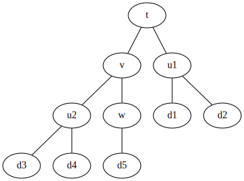

Overview of IRPF90
==================

A scientific program (or sub-program) is a complicated function
of its data. One can represent the program as a tree whose root
is the output and whose leaves are the data. The nodes are the intermediate variables, and the vertices represent the *needs/needed_by* relationships.

Let us consider a program which computes `t( u(d1,d2), v(u(d3,d4), w(d5)) )` with

```
u(x)   = x + y + 1
v(x)   = x + y + 2
w(x)   = x + 3
t(x,y) = x + y + 4
```

This program can be represented with the following tree:



L'écriture du programme en Fortran nécessiterait au programmeur d'avoir cet arbre en tête :

.. code-block:: fortran

  program calcule_t
    implicit none
    integer :: d1, d2, d3, d4 d5  ! Donnees d'input
    integer :: u1, u2, v, w, t    ! Variables intermediaires
    call lecture(d1,d2,d3,d4,d5)
    call calcule_u(d1,d2,u1)
    call calcule_u(d3,d4,u2)
    call calcule_w(d5,w)
    call calcule_v(u2,w,v)
    call calcule_t(u1,v,t)
    write(*,*), "t=", t
  end program

De cette façon, le programmeur dit à la machine ce qu'elle doit faire étape par
étape : on parle de programmation impérative. Si les étapes ne sont pas données
dans la bonne séquence, le programme est faux. Ainsi à chaque ligne, il faut connaître
l'état de l'ensemble du programme, et donc les dépendence entre les variables.
Dans cette approche, la pensée du programmeur va des feuilles de l'arbre vers la racine.

Le même programme peut être ré-écrit en pensant différemment. Au lieu de
dire à la machine ce qu'elle doit faire étape par étape, on peut plutôt lui
dire ce que l'on veut. Cela revient à penser le programme en partant de la
racine vers les feuilles.

.. code-block:: fortran

  program calcule_t
    implicit none
    integer :: d1, d2, d3, d4 d5    ! Donnees d'input
    integer :: u1, u2, v, w, t      ! Fonctions
    call lecture(d1,d2,d3,d4,d5)
    write(*,*), "t=", t( u(d1,d2), v( u(d3,d4), w(d5) ) )
  end program

Ici, les relations de dépendences entre les variables sont exprimées à
travers l'appel de la fonction `t`, et le programmeur n'a plus besoin de spécifier une
séquence particulière. Il ne connaît d'ailleurs pas *a priori* l'ordre dans
lequel vont s'effectuer les appels des fonctions `w(d5)` et `u(d3,d4)`, mais il
doit toujours avoir l'arbre en tête pour écrire le programme.

Avec IRPF90, le programmeur n'a pas besoin de connaître l'arbre : il est automatiquement
calculé. Ainsi, avec IRPF90 le programme serait tout simplement :

.. code-block:: fortran

    program calcule_t
      write(*,*) t
    end program
   
    BEGIN_PROVIDER [ integer, t ]
     t = u1+v+4
    END_PROVIDER
   
    BEGIN_PROVIDER [ integer, w ]
     w = d5+3
    END_PROVIDER
   
    BEGIN_PROVIDER [ integer, v ]
     v = u2+w+2
    END_PROVIDER
   
    BEGIN_PROVIDER [ integer, u1 ]
     call calcule_u(d1,d2,u1)
    END_PROVIDER
   
    BEGIN_PROVIDER [ integer, u2 ]
     call calcule_u(d3,d4,u2)
    END_PROVIDER
   
    subroutine calcule_u(x,y,u)
     integer, intent(in)  :: x,y
     integer, intent(out) :: u
     u = x+y+1
    end
   
    BEGIN_PROVIDER  [ integer, d1 ]
    &BEGIN_PROVIDER [ integer, d2 ]
    &BEGIN_PROVIDER [ integer, d3 ]
    &BEGIN_PROVIDER [ integer, d4 ]
    &BEGIN_PROVIDER [ integer, d5 ]
     call lecture(d1,d2,d3,d4,d5)
    END_PROVIDER

De cette façon, le programmeur exprime facilement sa pensée: "Imprime `t` à l'écran."
Il n'a absolument pas besoin de savoir de quoi dépend `t`, comment `t` est
calculé ou si `t` a déjà été calculé précédemment. Le programmeur veut `t`
et rien de plus.
Cela rend le développement collaboratif beaucoup plus simple.

Pour chaque noeud de l'arbre on écrit un **provider**, c'est-à-dire une
subroutine dont le rôle est de construire la variable associée au noeud. Il est
absolument nécessaire que la quantité soit contruite correctement dans le
provider, tel que lorsqu'un provider est executé on ait la garantie que la
quantité est construite correctement. Il est possible d'ajouter des assertions
qui seront vérifées à l'exécution avec le mot-clé `ASSERT`. 

.. code-block:: fortran

    BEGIN_PROVIDER [ integer, u2 ]
     call calcule_u(d3,d4,u2)
     ASSERT (u2 < d3)
    END_PROVIDER

donne le résultat suivant en cas d'échec :

.. code-block:: bash

    Stack trace:            0
    -------------------------
    provide_t
    provide_v
    provide_u2
    u2
    -------------------------
    u2: Assert failed:
     file: uvwt.irp.f, line: 23
    (u2 < d3)
    u2 =            8
    d3 =            3
    
    STOP 1


IRPF90 analyse le code écrit dans tous les fichiers `*.irp.f` du répertoire
courant et repère les dépendences entre les variables. On voit dans le code que le
provider de `v` a besoin de `u2` et de `w`. Ainsi, IRPF90 garantit qu'avant
d'exécuter le provider de `v`, les providers de `u2` et de `w` auront
été exécutés, et donc que les variables `u2` et `w` seront *valides*. Cependant,
le programmeur ne sait pas à quel moment exact le provider de tel ou tel noeud
sera appelé.  L'utilisation de `t` dans le programme principal déclenche
l'exploration récursive de l'arbre avant l'impression de la valeur de `t` à
l'écran.  Cela revient exactement à utiliser la fonction `t( u(d1,d2), v(
u(d3,d4), w(d5) ) )` où les paramètres des fonctions sont implicites (Implicit
Reference to Parameters in Fortran 90 : IRPF90).

Dès qu'un provider a été exécuté, la variable associée est marquée comme valide.
Elle ne sera donc pas reconstruite mais tout simplement ré-utilisée si un
autre provider a besoin de la même variable.

Compilation
-----------

IRPF90 est un générateur de code Fortran 90.
La gestion de l'arbre est réalisée avant la compilation. Ainsi, IRPF90
génère un code Fortran90 où l'exploration de l'arbre est écrite directement
dans le code généré. Ainsi, toute la gestion de l'arbre
est statique et ne nuit absolument pas à la vitesse d'exécution du programme qui
reste du Fortran90 standard. L'arbre est re-calculé avant chaque compilation car
la modification du code peut induire de nouvelles dépendences entre les variables.
Notons qu'il est bien entendu possible d'utiliser toutes les bibliothèques
compatibles avec du Fortran (MPI, openMP, BLAS/Lapack, etc).

Il est possible d'écrire plusieurs programmes dans le même répertoire qui utilisent
des providers communs. Cela est très utile pour construire des tests unitaires. Si l'on
veut écrire un test pour la variable `u1`, il suffit d'écrire un programme principal qui
imprime `u1` à l'écran, et seul le sous-arbre de `u1` sera généré à l'exécution.

Puisque IRPF90 connaît les dépendances entre les variables, il connaît également les
dépendances entre les fichiers et peut donc écrire un Makefile automatiquement qui
permettra de compiler tous les programmes du répertoire courant.

Modification dynamique des valeurs des noeuds
---------------------------------------------

Les programmes scientifiques utilisent souvent des processus itératifs. Ceux-ci utilisent
le même arbre de production à chaque itération, mais les valeurs des feuilles
de l'itération *n+1* dépendent de la valeur de la racine de l'itération *n*.
Cela implique de pouvoir modifier la valeur d'une variable à l'extérieur de son provider,
et d'informer le système de cette modification afin que les dépendences entre variables soient
mises à jour et que la nouvelle racine soit construite correctement.

.. figure:: touch.pdf
   :width: 18cm

   Figure 2: Invalidation de noeuds suite à l'utilisation de *TOUCH x*.

Le mot-clé *TOUCH* a été introduit pour gérer les modifications en dehors des providers.
Ce mot-clé rend valide la variable modifiée (touchée), mais invalide tous les
noeuds qui ont besoin directement ou indirectement de cette variable.
Dans l'exemple de la Figure 2, la variable *z* a besoin de *x* et de *y* pour être
construite. En (a), l'arbre est dans un état où tout est construit et valide :
tous les noeuds sont représentés en vert. En (b), on modifie la valeur de `x`, et ont exécute
`TOUCH x`. En (c), on voit que `x` est valide, mais tous les noeuds entre lui
et la racine ont été invalidés (en rouge). Ainsi, si l'on redemande la valeur de `z`, seul
le noeud en rouge au dessous de `z` sera recalculé pour construire la nouvelle
valeur de `z`.

Un exemple intéressant du `TOUCH` est le calcul d'une dérivée par différence finie, qui peut
être utilisé pour vérifier l'implémentation de la dérivée d'une fonction. L'exemple
suivant calcule la dérivée de `F` par rapport à `x` :

.. code-block:: fortran

   BEGIN_PROVIDER [ real, dF ]
     real :: F_p, F_m
     real, parameter :: delta_x = 0.001

     ! Calcul de F(x + 1/2.delta_x)
     x += 0.5*delta_x
     TOUCH x
     F_p = F

     ! Calcul de F(x - 1/2.delta_x)
     x -= delta_x
     TOUCH x
     F_m = F

     ! Calcul de dF
     dF = (F_p - F_m)/delta_x

     ! On remet x a sa position initiale
     x += 0.5*delta_x
     TOUCH x
   END_PROVIDER


Variables tableaux
------------------

Un tableau est considéré comme valide lorsque toutes ses valeurs ont été calculées.
Les dimensions des tableaux sont soit des variables qui ont des providers, soit des
constantes, soit des intervalles. 

.. code-block:: fortran

   BEGIN_PROVIDER [ integer, fact_max ]
     fact_max = 10
   END_PROVIDER

   BEGIN_PROVIDER [ double precision, fact, (0:fact_max) ]
     implicit none
     integer :: i
     fact(0) = 1.d0
     do i=1,fact_max
       fact(i) = fact(i-1)*dble(i)
     end do
   END_PROVIDER

Dans cet exemple, puisque le tableau `fact` dépend de sa variable de
dimensionnement `fact_max`, la modification de la dimension du tableau à
travers `TOUCH fact_max` invalidera le tableau `fact`, et il sera re-calculé
avec la bonne dimension à sa prochaine utilisation. Toutes les allocations sont
vérifiées et un message d'erreur apparaît à l'exécution en cas d'impossibilité
d'allocation du tableau. 

La mémoire réservée pour un tableau peut être libérée en utilisant le mot-clé
`FREE`. Par exemple :

.. code-block:: fortran

   BEGIN_PROVIDER [ double precision, table2, (size(table1,1)) ]
     implicit none
     table2(:) = 2.d0 * table1(:)
     FREE table1
   END_PROVIDER

Lorsque `table1` est libéré, le noeud correspondant est marqué comme invalide. Ainsi,
si `table1` est re-demandé plus tard, il sera préalablement ré-alloué et reconstruit.

Documentation du code
---------------------

À l'intérieur de chaque provider, il est recommandé d'écrire quelques lignes de
documentation pour décrire la variable construite.

.. code-block:: fortran

   BEGIN_PROVIDER [ double precision, fact, (0:fact_max) ]
     implicit none

     BEGIN_DOC
   !  Computes an array of fact(n)
     END_DOC

     integer :: i
     fact(0) = 1.d0
     do i=1,fact_max
       fact(i) = fact(i-1)*dble(i)
     end do
   END_PROVIDER

Lors de la compilation, la liste de toutes les variables est écrite dans un fichier
nommé `irpf90_entities`, et une *man page* est crée pour chaque variable. Cette page contient
la documentation présente dans le block de documentation, mais aussi quelles sont les
variables nécessaires et quelles variables ont besoin de la variables courante. Ces pages sont
accessibles avec l'outil `irpman` :

.. code-block:: bash

  $ irpman fact
  IRPF90 entities(l)                          fact                          IRPF90 entities(l)
  
  Declaration
         double precision, allocatable :: fact   (0:fact_max)
  
  Description
         !  Computes an array of fact(n)
  
  File
         fact.irp.f
  
  Needs
         fact_max
  
  Needed by
         binom
         exponential_series
  
  IRPF90 entities                             fact                          IRPF90 entities(l)
  

Templates
---------

Il arrive parfois que l'on doive écrire plusieurs morceaux de code qui utilisent un
même schéma. En C++ par exemple on utiliserait des patrons de fonctions, de classes ou
d'expressions.
Prenons un exemple où l'on veut créer plusieurs providers et fonctions semblables :

.. code-block:: fortran

  BEGIN_TEMPLATE

    BEGIN_PROVIDER [ $type , $name ]
     call find_in_input('$name', $name)
    END_PROVIDER 

    logical function $name_is_zero()
      $name_is_zero = ($name == 0)
    end function

  SUBST [ type, name ]

    integer    ;   size_tab1 ;;
    integer    ;   size_tab2 ;;
    real       ;   distance  ;;
    real       ;   x         ;;
    real       ;   y         ;;
    real       ;   z         ;;

  END_TEMPLATE

Cet exemple génère automatiquement un provider et une fonction `*_is_zero` 
pour chaque couple apparaissant au dessous du mot-clé `SUBST`.

Interaction avec le shell et metaprogrammation
-----------------------------------------------

On peut avoir envie d'insérer au milieu de son programme le résultat d'une commande
du shell exécutée à la compilation. Prenons un cas typique où l'on souhaite 
que le programme imprime à l'écran la date de compilation et la version de git
à laquelle il correspond :

.. code-block:: bash

     subroutine print_git_log
      write(*,*) , '----------------'
      BEGIN_SHELL [ /bin/bash ]
         echo "write(*,*)" \'Compiled by $(whoami) on $(date)\'
      END_SHELL 
      write(*,*) , 'Last git commit:'
      BEGIN_SHELL [ /bin/bash ]
        git log -1 | sed "s/'//g" | sed "s/^/    write(*,*) '/g" | sed "s/$/'/g"
      END_SHELL
      write(*,*) , '----------------'
     end


L'insertion de sorties de scripts dans le code permet également d'aller au delà des templates, et de
générer du code de façon mécanique. Voici un exemple qui génère des fonctions particulières
pour calculer `x` à la puissance `n` en utilisant un minimum de multiplications :

.. code-block:: python

  BEGIN_SHELL [ /usr/bin/python ]
  
  POWER_MAX = 20
  
  def compute_x_prod(n,d):
    if n == 0:
      d[0] = None
      return d
    if n == 1:
      d[1] = None
      return d
    if n in d:
      return d
    m = n/2
    d = compute_x_prod(m,d)
    d[n] = None
    d[2*m] = None
    return d
  
  def print_function(n):
    keys = compute_x_prod(n,{}).keys()
    keys.sort()
    output = []
    print "real function power_%d(x1)"%n
    print " real, intent(in) :: x1"
    for i in range(1,len(keys)):
      output.append( "x%d"%keys[i] )
    print " real :: "+', '.join(output)
    for i in range(1,len(keys)):
      ki = keys[i]
      ki1 = keys[i-1]
      if ki == 2*ki1:
        print " x%d"%ki + " = x%d * x%d"%(ki1,ki1)
      else:
        print " x%d"%ki + " = x%d * x1"%(ki1)
    print " power_%d = x%d"%(n,n)
    print "end"
  
  for i in range(POWER_MAX):
    print_function(i+1)
    print ''

  END_SHELL  

Voici un échantillon du code généré :

.. code-block:: fortran
  
  real function power_1(x1)
   real, intent(in) :: x1
   real :: 
   power_1 = x1
  end
  
  real function power_2(x1)
   real, intent(in) :: x1
   real :: x2
   x2 = x1 * x1
   power_2 = x2
  end
  
     ...
  
  real function power_20(x1)
   real, intent(in) :: x1
   real :: x2, x4, x5, x10, x20
   x2 = x1 * x1
   x4 = x2 * x2
   x5 = x4 * x1
   x10 = x5 * x5
   x20 = x10 * x10
   power_20 = x20
  end


